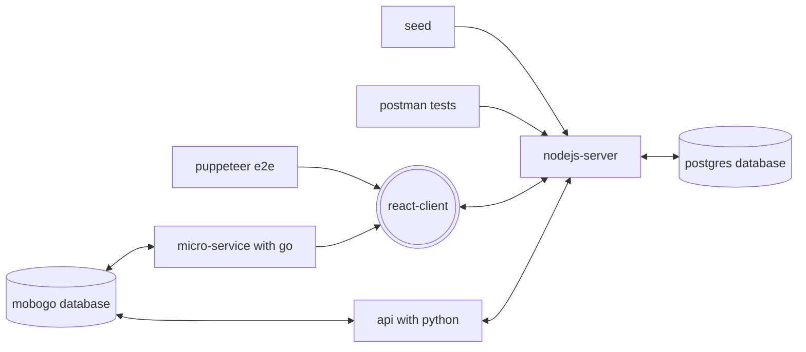

## What is this?

This is a refactor/extension of/on a project started/created by fellow student [Michelle Pesch](https://github.com/mipes4/sportsbetting_fe) at Codaisseur.

---

## Setup

---

## Quick start

Start database and mock soccer api

> docker-compose up --build

Seed database

> cd server && bash set-up-dev-db.sh

Run server

> cd server && npm run dev

Run client

> cd client && npm start

Run go-sevice for rules

> cd go-service && go run main.go

Todo: implement mongodb
